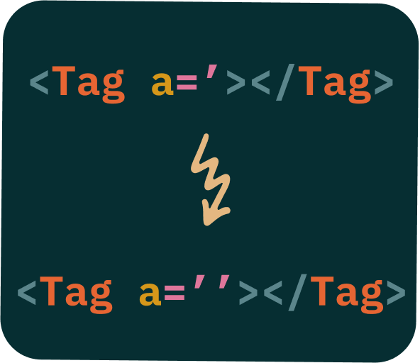
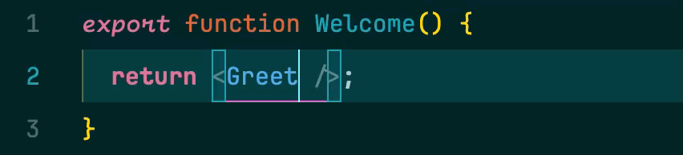

# AutoQuotes JSX for VS Code

<p align="center">
  
</p>
<p align="center">
This extension automatically adds quotes `''` around JSX and TSX prop values when you type the equals sign (`=`). It streamlines your React/JSX/TSX development workflow by reducing repetitive typing.
</p>

### Demo

| Before                          | After                          |
| ------------------------------- | ------------------------------ |
|  |  |

## Features

- **Automatic Quotes Insertion:** When you type `=` after a prop name in a JSX or TSX element, the extension automatically inserts `''` and places the cursor inside the quotes.

  ```jsx
  // Before:
  <MyComponent someProp=
  // After (cursor indicated by |):
  <MyComponent someProp='|'
  ```

- **Backspace Handling:** If you press Backspace when the cursor is _between_ the inserted quotes, _both_ quotes are removed.

  ```jsx
  // Before (cursor indicated by |):
  <MyComponent someProp='|'
  // Press Backspace
  // After:
  <MyComponent someProp=
  ```

## Installation

1.  Open Visual Studio Code.
2.  Go to the Extensions view (Ctrl+Shift+X or Cmd+Shift+X).
3.  Search for "AutoQuotes JSX".
4.  Click "Install".
5.  Reload VS Code.

## Usage

Simply open a `.jsx` or `.tsx` file and start writing JSX/TSX code. The extension will automatically insert quotes when appropriate. No configuration is required.

## Example

1.  Open a `.jsx` or `.tsx` file.
2.  Type a JSX element and a prop name, followed by `=`:

    ```jsx
    <MyComponent myProp=
    ```

3.  The extension will automatically add the quotes:

    ```jsx
    <MyComponent myProp='|'
    ```

    (The `|` represents the cursor position.)

4.  Type the value of your prop.
5.  If you press Backspace immediately after, both quotes will be deleted.

## Contributing

If you find a bug or have a feature request, please open an issue on GitHub. Pull requests are also welcome!

## License

This extension is released under the [MIT License](LICENSE).

## Development

To develop this extension locally:

1.  Clone the repository.
2.  Run `pnpm install` in the project directory.
3.  Open the project in VS Code.
4.  Press F5 to run the extension in the Extension Development Host.
5.  Run `pnpm test` to run tests.
